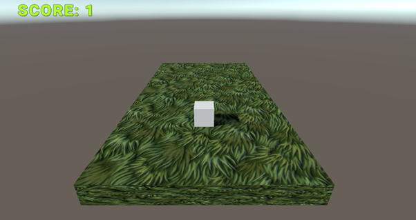
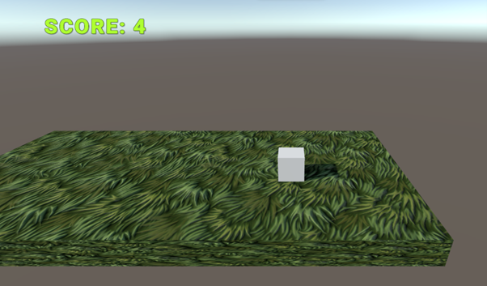

# Doofus Adventure Game

## Description
Doofus Adventure Game is a fun and challenging platformer where you guide a character named Doofus across disappearing platforms called Pulpits. The objective is to survive as long as possible by jumping from one pulpit to another while accumulating points for each successful move. If Doofus falls off the platform, the game ends.

## Table of Contents
1. [Installation](#installation)
2. [Running the Game](#running-the-game)
3. [Screenshots](#screenshots)
4. [Project Structure](#project-structure)
5. [How to Play](#how-to-play)
6. [Credits](#credits)

## Installation

### 1. Build Files
- Navigate to the `Build` folder.
- Open the `index.html` file in your preferred web browser to start playing the game.

### 2. Project Files
If you want to explore or modify the source code:
- Download and unzip the `DoofusAdventure.zip` file from the repository.
- Open the project in Unity (tested on Unity version 2022.3.2f1).

### 3. Unity Setup
To run the project in Unity:
1. Clone or download the project files.
2. Open Unity Hub.
3. Add the project to Unity Hub by clicking "Add" and selecting the project folder.
4. Open the project in Unity.
5. Press the "Play" button to run the game in the Unity Editor.

## Running the Game
- Simply open the `index.html` file located in the `Build` folder.
- The game will load in your browser, and you can start playing immediately.

## Screenshots
Here are some screenshots of the game:

- 
- 
- 

> *Make sure to replace `images/screenshot1.png`, `images/screenshot2.png`, and `images/screenshot3.png` with the actual paths to your images.*

## Project Structure
The project is structured as follows:
- `Assets/` - Contains all the game assets including scripts, prefabs, and scenes.
- `Build/` - Contains the build files necessary to run the game in a browser.
- `ProjectSettings/` - Contains the Unity project settings.
- `DoofusAdventure.zip` - A zipped file containing the full Unity project for developers who wish to explore or modify the game.

## How to Play
- Use **WASD** keys to move Doofus (Forward, Left, Backward, Right).
- Doofus must jump to the next pulpit before the current one disappears.
- The score increases by 1 with each new pulpit created. The game ends if Doofus falls off the platform.
  
## Credits
- Developed by [Your Name]
